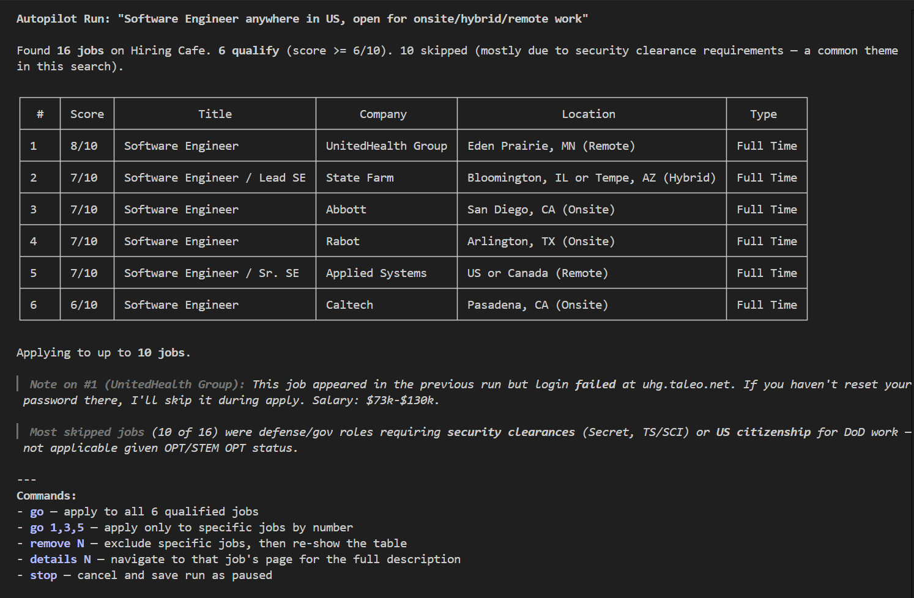
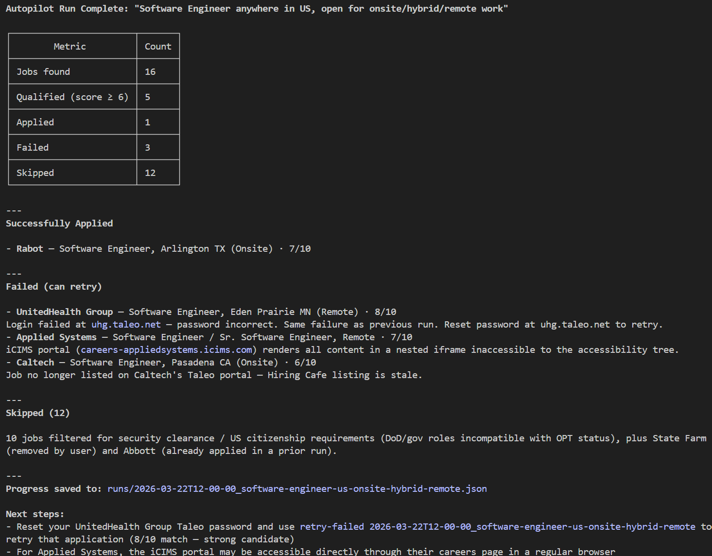

# JobPilot

A [Claude Code](https://docs.anthropic.com/en/docs/claude-code) plugin that automates your job search end-to-end: find matching positions, auto-fill applications, generate cover letters, write proposals, and prep for interviews - all powered by your resume.



## What It Does

| Skill | Command | What it does |
| ----- | ------- | ------------ |
| **Autopilot** | `/autopilot <query>` | Search boards, score matches, and apply to jobs autonomously in batch |
| **Apply** | `/apply-job <url>` | Auto-fill a single job application form via browser automation |
| **Search** | `/search-job <query>` | Search job boards and rank results by qualification fit |
| **Cover Letter** | `/cover-letter <job_desc>` | Generate a tailored cover letter matched to your experience |
| **Upwork Proposal** | `/upwork-proposal <job_desc>` | Generate a concise, client-focused Upwork proposal |
| **Interview Prep** | `/interview <job_desc>` | Generate Q&A prep (behavioral, technical, system design) |
| **Humanizer** | `/humanizer <text>` | Rewrite text to remove AI patterns and sound natural |

## Quick Start

### 1. Install the plugin

```bash
git clone --recursive https://github.com/suxrobgm/jobpilot.git
claude --plugin-dir ./jobpilot
```

> Use `--recursive` to pull the [humanizer](https://github.com/blader/humanizer) submodule.


Once available on the Claude plugin marketplace, you'll also be able to install with:

```bash
claude plugin install jobpilot
```

### 2. Create your profile

```bash
cp profile.example.json profile.json
```

Edit `profile.json` with your info. Here's the structure:

```json
{
  "personal": {
    "firstName": "Jane",
    "lastName": "Doe",
    "email": "jane@example.com",
    "phone": "(555) 123-4567",
    "website": "https://janedoe.dev",
    "linkedin": "https://linkedin.com/in/janedoe",
    "github": "https://github.com/janedoe",
    "resumePath": "/path/to/your/resume.pdf"
  },
  "workAuthorization": {
    "usAuthorized": true,
    "requiresSponsorship": false,
    "visaStatus": "OPT",
    "optExtension": "STEM OPT"
  },
  "eeo": {
    "gender": "Prefer not to disclose",
    "race": "Prefer not to disclose",
    "ethnicity": "Prefer not to disclose",
    "hispanicOrLatino": "Prefer not to disclose",
    "veteranStatus": "Prefer not to disclose",
    "disabilityStatus": "Prefer not to disclose"
  },
  "address": {
    "street": "123 Main St",
    "city": "Portland",
    "state": "ME",
    "zipCode": "04101",
    "country": "United States"
  },
  "credentials": {
    "default": {
      "email": "jane@example.com",
      "password": "your-password"
    }
  },
  "jobBoards": [
    { "name": "LinkedIn", "domain": "linkedin.com", "searchUrl": "https://www.linkedin.com/jobs/search/", "type": "search", "enabled": true, "email": "", "password": "" },
    { "name": "Indeed", "domain": "indeed.com", "searchUrl": "https://www.indeed.com/jobs", "type": "search", "enabled": true, "email": "", "password": "" },
    { "name": "Hiring Cafe", "domain": "hiring.cafe", "searchUrl": "https://hiring.cafe/jobs", "type": "search", "enabled": true, "email": "", "password": "" }
  ]
}
```

Your `profile.json` is gitignored -- credentials never leave your machine.

### 3. Add your resume

Set `personal.resumePath` to your resume file (PDF, DOCX, LaTeX, or plain text). All skills read it at runtime to understand your background. If you skip this, skills will ask on first run.

### 4. Allow browser permissions (recommended)

Add to `.claude/settings.json` to avoid permission prompts on every browser action:

```json
{
  "permissions": {
    "allow": [
      "mcp__plugin_jobpilot_playwright__*"
    ]
  }
}
```

## Usage

### Apply to a single job

```bash
/apply-job https://boards.greenhouse.io/company/jobs/12345
```

Navigates to the job page, reviews your qualification fit, logs in, fills every form field from your profile and resume, and waits for your confirmation before submitting.


### Search for jobs

```bash
/search-job "senior fullstack developer Portland ME remote"
```

Searches your enabled boards, scores each result against your resume (1-10), and presents a ranked table. From there you can apply, get details, or generate a cover letter for any result.

### Autopilot: batch search and apply

```bash
/autopilot "senior fullstack developer Portland ME remote"
```

The full autonomous workflow:

1. Searches all enabled boards and extracts matching jobs
2. Scores each job against your resume and filters by `minMatchScore`
3. Presents qualified jobs for your one-time approval
4. Applies to every approved job automatically -- no further prompts
5. Saves progress to `runs/` so you can resume if interrupted

Resume an interrupted run or retry failures:

```bash
/autopilot "resume"
/autopilot "retry-failed 2026-03-22T14-30-00_senior-fullstack-developer"
```



### Generate a cover letter

```bash
/cover-letter We're looking for a senior full-stack developer with React and .NET experience...
```

Analyzes the job description, matches it against your resume, writes a tailored cover letter, and passes it through the humanizer for natural tone.

### Write an Upwork proposal

```bash
/upwork-proposal Need a React/Node developer to build an analytics dashboard...
```

### Prep for an interview

```bash
/interview We're hiring a backend engineer to work on our API platform...
```

Generates role-specific prep: behavioral questions with STAR-format answers from your experience, technical deep-dives on the role's stack, system design scenarios, and gap analysis.

## Configuration

### Job Boards

The `jobBoards` array in `profile.json` controls which boards are used. Each entry has:

| Field | Required | Description |
| ----- | -------- | ----------- |
| `name` | Yes | Display name |
| `domain` | Yes | Used for credential matching during apply |
| `searchUrl` | For search boards | URL to navigate for job search |
| `type` | Yes | `"search"` (searchable boards) or `"ats"` (apply-only platforms like Greenhouse, Lever, Workday) |
| `enabled` | Yes | `true` / `false` |
| `email`, `password` | No | Board-specific credentials (falls back to `credentials.default`) |

Add any job board by appending a new entry -- no code changes needed.

### Autopilot Settings

Add an `autopilot` section to `profile.json`:

```json
"autopilot": {
  "minMatchScore": 6,
  "maxApplicationsPerRun": 10,
  "confirmMode": "batch",
  "skipCompanies": ["CurrentEmployer Inc"],
  "skipTitleKeywords": ["intern", "principal"],
  "defaultStartDate": "2 weeks notice"
}
```

| Setting | Default | Description |
| ------- | ------- | ----------- |
| `minMatchScore` | 6 | Minimum fit score (1-10) to qualify |
| `maxApplicationsPerRun` | 10 | Max applications per run |
| `confirmMode` | `"batch"` | `"batch"` = review list before applying. `"auto"` = skip confirmation when all jobs score >= 6 |
| `skipCompanies` | `[]` | Company names to always skip |
| `skipTitleKeywords` | `[]` | Title keywords to filter out |
| `defaultStartDate` | `"2 weeks notice"` | Default answer for start date fields |

### Work Authorization

The `workAuthorization` section auto-fills visa and sponsorship questions on application forms:

```json
"workAuthorization": {
  "usAuthorized": true,
  "requiresSponsorship": false,
  "visaStatus": "Green Card",
  "optExtension": ""
}
```

### EEO / Diversity Questions

The `eeo` section auto-fills gender, race, ethnicity, veteran status, and disability questions. Set each field to your answer or `"Prefer not to disclose"`:

```json
"eeo": {
  "gender": "Prefer not to disclose",
  "race": "Prefer not to disclose",
  "ethnicity": "Prefer not to disclose",
  "hispanicOrLatino": "Prefer not to disclose",
  "veteranStatus": "Prefer not to disclose",
  "disabilityStatus": "Prefer not to disclose"
}
```

## How It Works

- All skills are **prompt-based** - no compiled code, just markdown instruction files that Claude follows at runtime
- Browser automation uses [Playwright MCP](https://github.com/anthropics/claude-code/blob/main/docs/mcp.md) for navigation, form filling, and page reading
- Shared logic (authentication, form filling, browser tips) lives in `skills/_shared/` and is referenced by each skill
- The autopilot skill tracks progress in `runs/*.json` files so interrupted runs can resume exactly where they left off
- Previously applied jobs are automatically excluded from future searches using `scripts/applied-jobs.sh`
- Cover letters and proposals are passed through the [humanizer](https://github.com/blader/humanizer) to remove AI writing patterns

## Credits

- [Humanizer](https://github.com/blader/humanizer) by blader - included as a git submodule (MIT License)

## License

MIT
