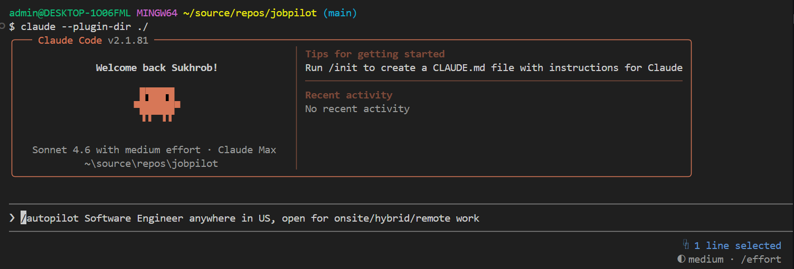
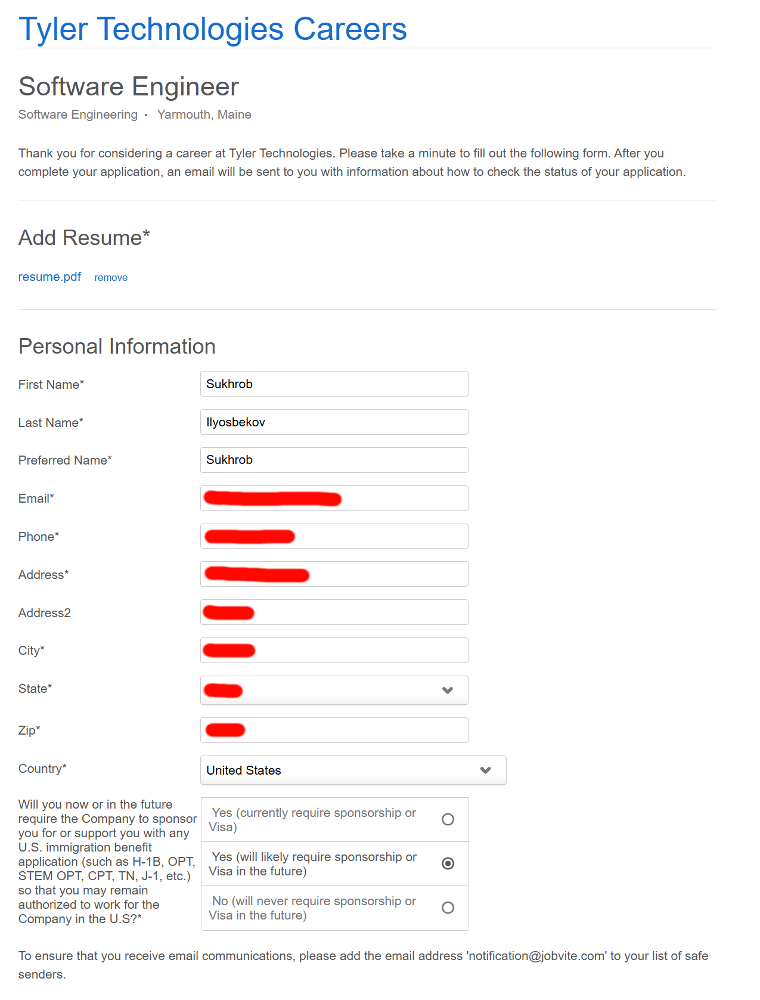

# JobPilot

A [Claude Code](https://docs.anthropic.com/en/docs/claude-code) plugin that automates your job search end-to-end: find matching positions, auto-fill applications, generate cover letters, write proposals, and prep for interviews - all powered by your resume.


## What It Does

| Skill | Command | What it does |
| ----- | ------- | ------------ |
| **Autopilot** | `/autopilot <query>` | Search boards, score matches, and apply to jobs autonomously in batch |
| **Apply** | `/apply <url>` | Auto-fill a single job application form via browser automation |
| **Batch Apply** | `/apply-batch <file>` | Apply to multiple jobs from a file of URLs with scoring and batch approval |
| **Search** | `/search <query>` | Search job boards and rank results by qualification fit |
| **Cover Letter** | `/cover-letter <job_desc>` | Generate a tailored cover letter matched to your experience |
| **Upwork Proposal** | `/upwork-proposal <job_desc>` | Generate a concise, client-focused Upwork proposal |
| **Interview Prep** | `/interview <job_desc>` | Generate Q&A prep (behavioral, technical, system design) |
| **Dashboard** | `/dashboard` | View application stats, success rates, and export to CSV |
| **Humanizer** | `/humanizer <text>` | Rewrite text to remove AI patterns and sound natural |

## Quick Start

### Prerequisites

- [Claude Code](https://docs.anthropic.com/en/docs/claude-code) CLI
- Git (Git for Windows includes Git Bash)
- [jq](https://jqlang.github.io/jq/download/) is required by utility scripts (auto-installed on first run if missing)

### 1. Install

```bash
git clone --recursive https://github.com/suxrobgm/jobpilot.git
claude --plugin-dir ./jobpilot
```



> Use `--recursive` to pull the [humanizer](https://github.com/blader/humanizer) submodule.

### 2. Set up your profile

```bash
cp profile.example.json profile.json
```

Edit `profile.json` with your personal info, resume path, credentials, and job board config. See [Configuration](docs/configuration.md) for the full reference.

On Windows PowerShell, run a local setup check with:

```powershell
.\scripts\check-setup.ps1
```

If `bash` is not on your PATH, run shell scripts through the wrapper:

```powershell
.\scripts\run-bash.ps1 scripts\overleaf-clone.sh
```

For Overleaf setup on Windows, you can also use the native PowerShell script:

```powershell
.\scripts\overleaf-clone.ps1
```

To run the full Overleaf bootstrap on Windows without Claude-specific commands:

```powershell
.\scripts\overleaf-bootstrap.ps1
```

To run the standalone unattended workflow:

```powershell
.\scripts\jobpilot-autorun.ps1
```

To bootstrap Codex CLI for standalone JD-aware LaTeX editing:

```powershell
.\scripts\codex-bootstrap.ps1
```

If Overleaf prompts for a browser verification step before PDF download, run this once first to seed the persistent browser session used by autorun:

```powershell
.\scripts\overleaf-login-bootstrap.ps1
```

If the search boards show authwalls, Cloudflare, or other anti-bot pages, seed the same persistent browser profile for job search too:

```powershell
.\scripts\search-session-bootstrap.ps1
```

To enable JD-aware AI resume tailoring in the standalone flow, keep the `codex` block enabled in `profile.json` and run `.\scripts\codex-bootstrap.ps1`. JobPilot can use your existing Codex CLI ChatGPT login or fall back to `CODEX_API_KEY` or `OPENAI_API_KEY` from `.env`.
If you want the shortcut to behave more like the original Claude-powered flow, set `standalone.requireTailoringProvider` to `codex-cli` so JobPilot refuses to apply unless Codex CLI tailoring succeeds and produces a tailored PDF.
If you want to watch the browser work live, set `standalone.headless` to `false` in `profile.json`.
Standalone now supports two execution styles:
- `executionMode: "unattended-safe"` for true fire-and-forget runs. It disables manual prompts and skips hosts outside a conservative safe-host allowlist.
- `executionMode: "supervised"` for Claude-like visible runs. It keeps manual prompts on, works best with `browserName: "chrome"`, and can pause so you can use your own autofill extension before JobPilot continues.

Unattended runs now follow this order: discover jobs -> tailor with Codex CLI or the configured AI provider -> compile/download the one-page Overleaf PDF -> upload the PDF into the ATS/company form -> submit -> record the result.
The standalone flow now prefers Codex CLI for real file editing of the LaTeX resume before Overleaf compile, and still treats a deliberate no-op as a valid AI-tailoring result.
LinkedIn is treated as a discovery source in unattended mode. Aggregator pages like LinkedIn are skipped unless JobPilot can extract a direct external apply link.
The current standalone defaults also disable `Indeed` and `Hiring Cafe` because both are frequently blocked in unattended browser sessions, and use `direct-ats-first` ranking so Greenhouse, Lever, and Workday-style apply links are prioritized.
Standalone search and autorun can also enforce a posting-age window such as `past 24 hours` through `standalone.postedWithinHours`.
Redirector-style hosts such as `jobright.ai`, `appcast`, and similar non-ATS wrappers are also skipped in unattended mode, and repeated login/verification/incomplete failures on the same apply host are short-circuited for the rest of the run.
The ATS filler now also handles hidden resume upload inputs better, which matters on sites like Lever where the visible upload control often wraps a hidden file field.
Hard ATS hosts such as Workday, UKG/UltiPro, ADP, iCIMS, Taleo, Oracle Recruiting, SilkRoad, and Avature can now fall back to a Codex-assisted apply planner. JobPilot also uses that Codex-assisted path on non-preferred external ATS hosts, which is much closer to the original Claude-driven behavior on tricky forms.
That Codex-assisted apply mode does not bypass real login walls, CAPTCHA, email verification, or MFA. It helps Playwright choose better guest/manual paths and field actions when the ATS UI is unusually dynamic.
If an ATS requires account creation before applying, JobPilot now treats that as part of the application flow and fills the password fields from `credentials.default.password` unless you configured a board-specific credential override.
If you prefer to watch and occasionally trigger your own browser autofill extension, set `standalone.manualAutofillAssist` to `true`. On difficult ATS pages, JobPilot will pause in the visible browser, let you use the extension manually, and then resume.
If you want supervised runs to reuse a real Chrome profile with installed extensions, set `standalone.browserName` to `chrome` and point `standalone.browserUserDataDir` plus `standalone.browserProfileDirectory` at your Chrome profile. Close regular Chrome first before launching JobPilot in that mode.
Each autorun now writes both a machine-readable run JSON and a human-readable `*.summary.txt` file in `runs`, including applied, failed, skipped, stage-specific totals, and skip buckets such as duplicate, no-direct-apply, and too-old postings.
Standalone completion summaries now also group outcomes by board/apply host and break down why jobs failed or were skipped, closer to the original Claude `/autopilot` reporting style.

To create a Desktop shortcut for the unattended workflow:

```powershell
.\scripts\install-desktop-shortcut.ps1
```

On Windows, that shortcut is created in the Desktop path Windows resolves for your account, which is often `OneDrive\Desktop` on synced machines.

### 3. Allow browser permissions (recommended)

Add to `.claude/settings.json`:

```json
{
  "permissions": {
    "allow": [
      "mcp__plugin_jobpilot_playwright__*"
    ]
  }
}
```

## Usage

```bash
# Autopilot: search and apply to matching jobs autonomously
/autopilot "senior fullstack developer Portland ME remote"

# Apply to a single job
/apply https://boards.greenhouse.io/company/jobs/12345

# Apply to multiple jobs from a file
/apply-batch jobs-to-apply.txt

# Search for jobs
/search "software engineer remote"

# Generate a cover letter
/cover-letter We are looking for a senior full-stack developer...

# Write an Upwork proposal
/upwork-proposal Need a React/Node developer to build a dashboard...

# Prep for an interview
/interview We are hiring a backend engineer for our API platform...

# Resume an interrupted autopilot run
/autopilot "resume"

# View application tracking dashboard
/dashboard

# Export all applications to CSV
/dashboard "export"
```




## Documentation

- [Configuration](docs/configuration.md) - profile setup, job boards, autopilot settings, work authorization, EEO
- [How It Works](docs/how-it-works.md) - architecture, skill details, project structure
- [Standalone CLI](docs/standalone-cli.md) - run search, tailor, apply, and autopilot without Claude skills

## Credits

- [Humanizer](https://github.com/blader/humanizer) by blader - included as a git submodule (MIT License)

## License

MIT
